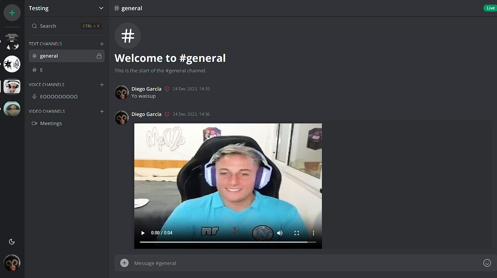
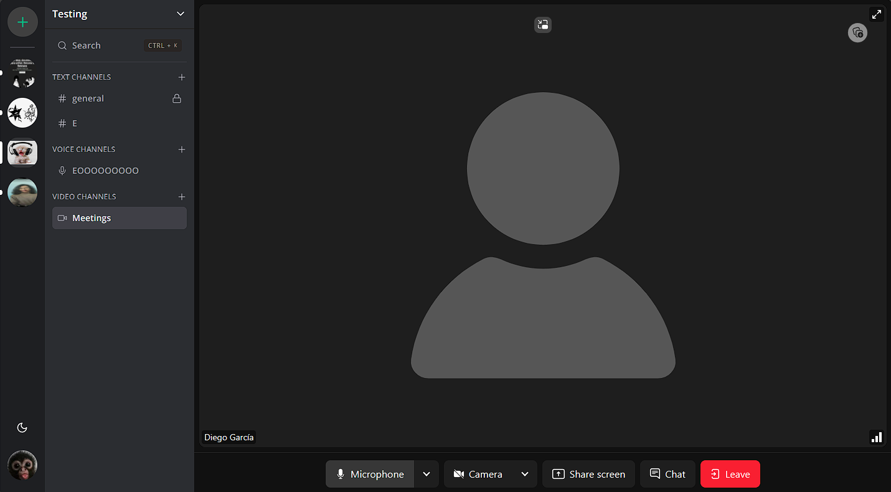
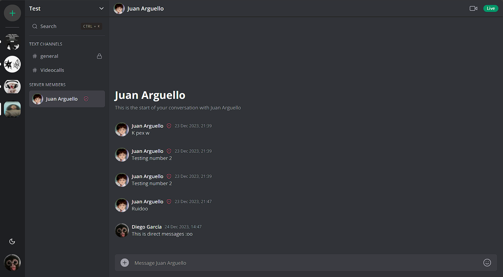
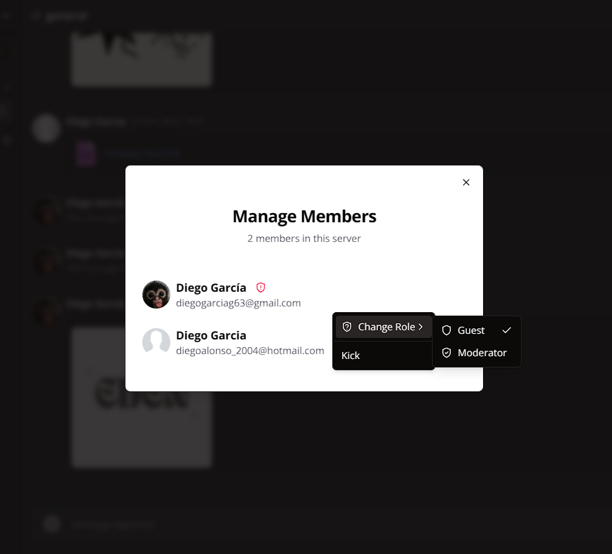

# EDEN - Community Chat Application


EDEN is a powerful community-driven chat application designed to provide a versatile and engaging virtual space. Connect with friends, share ideas, and explore a new realm of online communication.

## Features

- **Dynamic Chat Experience:** Engage in lively conversations with friends and community members.
- **User-Friendly Interface:** Intuitive design for seamless navigation and a pleasant user experience.
- **Community Building:** Foster connections, share experiences, and build a thriving online community.

## Key Functionalities

EDEN offers a rich set of features, including:

- **Member Management:** Easily manage members, roles, and permissions within your community.
- **Channel Operations:** Create, edit, and delete channels to organize discussions effectively.
- **Video and Audio Calls:** Initiate video and audio calls for immersive real-time communication.
- **Server Roles:** Define roles to streamline organization and assign specific permissions.
- **File Sharing:** Seamlessly send and receive files as part of your messaging experience.

## Screenshots

<div align="center" style="display: flex; flex-direction: column; align-items: center;">
  
  
  
  
</div>

## Technologies Used

EDEN leverages a variety of modern technologies, including:

- **Next.js:** A React framework for building server-rendered applications.
- **Tailwind CSS:** A utility-first CSS framework for quickly building custom designs.
- **Prisma:** A modern database toolkit for Node.js and TypeScript.
- **Clerk.js:** An authentication library for Next.js applications.
- **Socket.IO:** Real-time bidirectional event-based communication.
- **React Query:** A library for managing and caching server state in React applications.
- **Livekit:** Components and styles for integrating Livekit video features.

## Dependencies

Check out [package.json](./package.json) for a full list of dependencies and devDependencies.

## Getting Started

1. **Clone the repository:**
   ```bash
   git clone https://github.com/TuUsuario/eden.git
   cd eden

2. **Install dependencies:**
   ```bash
   npm install

3. Start the development server:
   ```bash
   npm run dev

4. Open your browser and visit http://localhost:3000.
   
## Contributing
We welcome contributions! Please follow our Contribution Guidelines to get started.

## License
This project is licensed under the MIT License.
